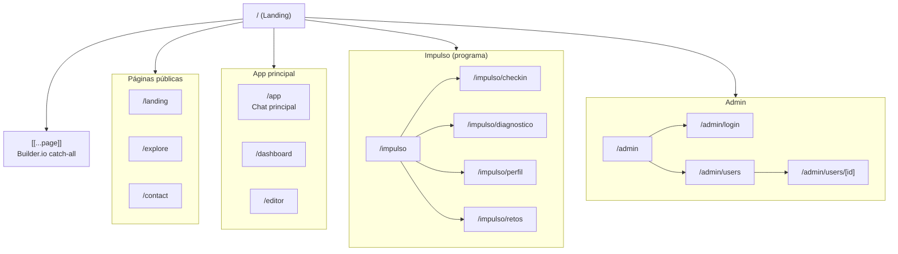
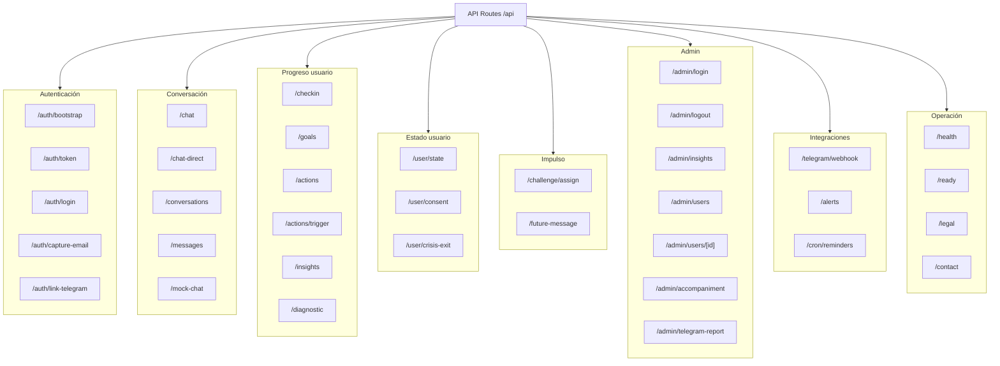
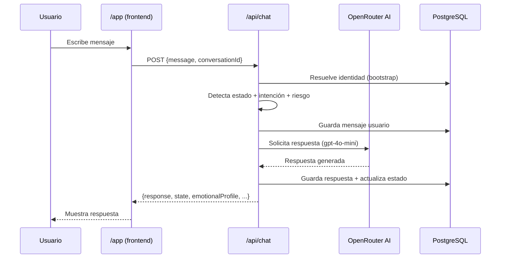
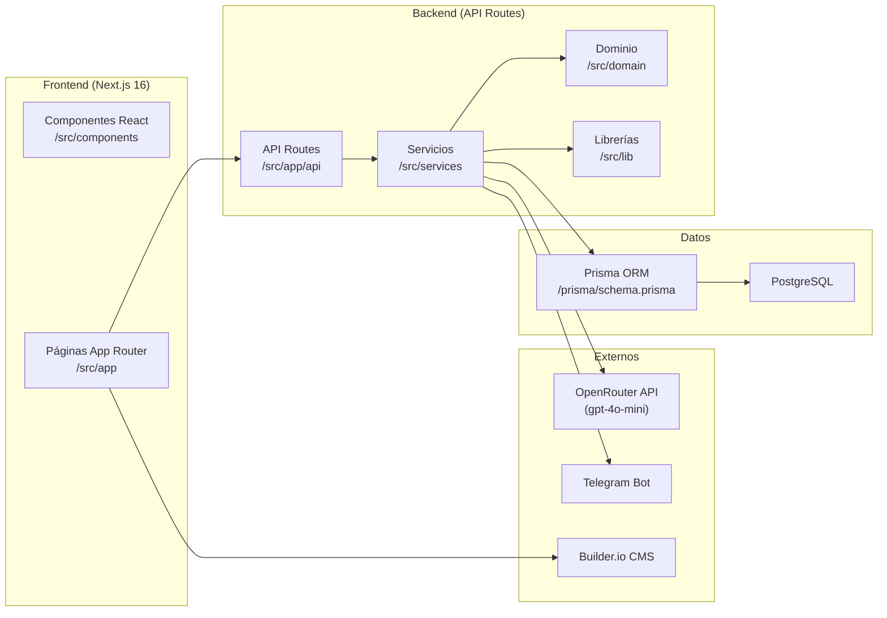

# Arquitectura visual — Luciernaga AI

## Mapa de rutas completo

```mermaid
graph TD
    ROOT["/ (Landing)"]
    BUILDER["[[...page]]\nBuilder.io catch-all"]

    subgraph PUBLIC["Páginas públicas"]
        LANDING["/landing"]
        EXPLORE["/explore"]
        CONTACT["/contact"]
    end

    subgraph APP["App principal"]
        APPPAGE["/app\nChat principal"]
        DASHBOARD["/dashboard"]
        EDITOR["/editor"]
    end

    subgraph IMPULSO["Impulso (programa)"]
        IMP["/impulso"]
        IMP_CHECKIN["/impulso/checkin"]
        IMP_DIAG["/impulso/diagnostico"]
        IMP_PERFIL["/impulso/perfil"]
        IMP_RETOS["/impulso/retos"]
    end

    subgraph ADMIN["Admin"]
        ADM["/admin"]
        ADM_LOGIN["/admin/login"]
        ADM_USERS["/admin/users"]
        ADM_USER_ID["/admin/users/[id]"]
    end

    ROOT --> PUBLIC
    ROOT --> APP
    ROOT --> IMPULSO
    ROOT --> ADMIN
    ROOT --> BUILDER

    IMP --> IMP_CHECKIN
    IMP --> IMP_DIAG
    IMP --> IMP_PERFIL
    IMP --> IMP_RETOS

    ADM --> ADM_LOGIN
    ADM --> ADM_USERS
    ADM_USERS --> ADM_USER_ID
```

---

## APIs por dominio

```mermaid
graph TD
    API["API Routes /api"]

    subgraph AUTH["Autenticación"]
        A1["/auth/bootstrap"]
        A2["/auth/token"]
        A3["/auth/login"]
        A4["/auth/capture-email"]
        A5["/auth/link-telegram"]
    end

    subgraph CHAT["Conversación"]
        C1["/chat"]
        C2["/chat-direct"]
        C3["/conversations"]
        C4["/messages"]
        C5["/mock-chat"]
    end

    subgraph PROGRESS["Progreso usuario"]
        P1["/checkin"]
        P2["/goals"]
        P3["/actions"]
        P4["/actions/trigger"]
        P5["/insights"]
        P6["/diagnostic"]
    end

    subgraph USER["Estado usuario"]
        U1["/user/state"]
        U2["/user/consent"]
        U3["/user/crisis-exit"]
    end

    subgraph IMPULSE["Impulso"]
        I1["/challenge/assign"]
        I2["/future-message"]
    end

    subgraph ADMIN["Admin"]
        AD1["/admin/login"]
        AD2["/admin/logout"]
        AD3["/admin/insights"]
        AD4["/admin/users"]
        AD5["/admin/users/[id]"]
        AD6["/admin/accompaniment"]
        AD7["/admin/telegram-report"]
    end

    subgraph INTEGRATIONS["Integraciones"]
        T1["/telegram/webhook"]
        T2["/alerts"]
        T3["/cron/reminders"]
    end

    subgraph OPS["Operación"]
        O1["/health"]
        O2["/ready"]
        O3["/legal"]
        O4["/contact"]
    end

    API --> AUTH
    API --> CHAT
    API --> PROGRESS
    API --> USER
    API --> IMPULSE
    API --> ADMIN
    API --> INTEGRATIONS
    API --> OPS
```

---

## Flujo de una conversación

```mermaid
sequenceDiagram
    participant U as Usuario
    participant FE as /app (frontend)
    participant API as /api/chat
    participant AI as OpenRouter AI
    participant DB as PostgreSQL

    U->>FE: Escribe mensaje
    FE->>API: POST {message, conversationId}
    API->>DB: Resuelve identidad (bootstrap)
    API->>API: Detecta estado + intención + riesgo
    API->>DB: Guarda mensaje usuario
    API->>AI: Solicita respuesta (gpt-4o-mini)
    AI-->>API: Respuesta generada
    API->>DB: Guarda respuesta + actualiza estado
    API-->>FE: {response, state, emotionalProfile, ...}
    FE-->>U: Muestra respuesta
```

---

## Capas de la arquitectura

```mermaid
graph LR
    subgraph FRONTEND["Frontend (Next.js 16)"]
        UI["Componentes React\n/src/components"]
        PAGES["Páginas App Router\n/src/app"]
    end

    subgraph BACKEND["Backend (API Routes)"]
        ROUTES["API Routes\n/src/app/api"]
        SERVICES["Servicios\n/src/services"]
        DOMAIN["Dominio\n/src/domain"]
        LIB["Librerías\n/src/lib"]
    end

    subgraph DATA["Datos"]
        PRISMA["Prisma ORM\n/prisma/schema.prisma"]
        POSTGRES["PostgreSQL"]
    end

    subgraph EXTERNAL["Externos"]
        OR["OpenRouter API\n(gpt-4o-mini)"]
        TG["Telegram Bot"]
        BUILDER["Builder.io CMS"]
    end

    PAGES --> ROUTES
    ROUTES --> SERVICES
    SERVICES --> DOMAIN
    SERVICES --> LIB
    SERVICES --> PRISMA
    PRISMA --> POSTGRES
    SERVICES --> OR
    SERVICES --> TG
    PAGES --> BUILDER
```
